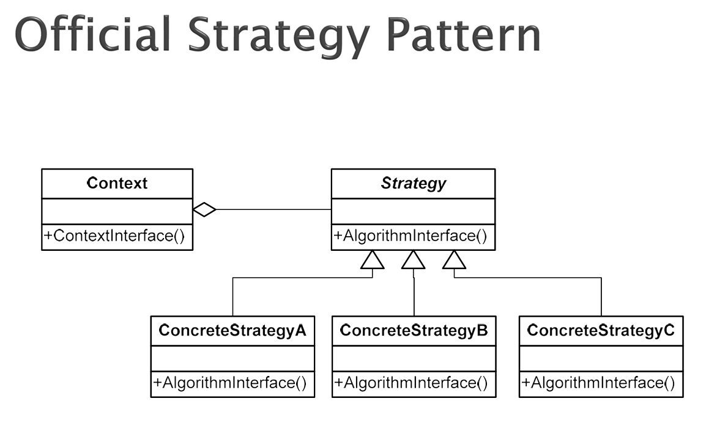

* S01 Strategy pattern  
전략패턴은 interface를 상속받아 알고리즘을 교체  
ex) 결제방식

* S02 옵저버 패턴  
주체 객체가 있고 주체 객체가 옵저버 객체 전체를 가지고 있는다.
주체 객체에 업데이트가 일어나면 전체 옵저버에 update 메소드 실행

* S03 Command 패턴  
커맨드 패턴은 요청을 객체로 만들어 실행자와 수행자를 분리한다.

* S04 Template 패턴  
이미 순서를 가진 객체를 관리  
final로 순서를 고정시킨 template도 hook이라는 메소드 개념으로 
유연성을 확보할 수도 있다.

* S05 State 패턴  
if문이 너무 많아질 때, 상태별로 클래스를 따로 만들어버리는 방법  
Strategy pattern과 유사하다.

* S06 iterator 패턴 
컬렉션의 내부 구조를 노출하지 않고, 요소를 순차적으로 접근하게 해주는 패턴

* S07 Cor(Chain of Responsibility Pattern) 패턴
CoR 패턴은 요청을 체인으로 전달하며 처리 책임을 분산한다.

* S08 Factory_pattern  
객체 생성을 서브클래스에 위임하는 패턴. 어떤 객체를 만들지는 하위 클래스가 결정한다 
✔ 어떤 객체를 생성할지 상위 클래스가 몰라도 될 때  
✔ 객체 생성 로직이 바뀔 가능성이 있을 때  
✔ 생성 책임을 한 곳에 모으고 싶을 때  
✔ new가 고차원 로직에 흩어지기 시작할 때  
Abstract Factory 패턴  
관련된 객체들의 “제품군”을 생성하는 인터페이스를 제공하는 패턴  
DIP (Dependency Inversion Principle)
고차원 컴포넌트 === 무엇을 할지 === service === import 하는쪽  
저차원 컴포넌트 === 어떻게 할지 === repository === import 당하는쪽  
고차원 컴포넌트가 저차원 컴포넌트에 의존적이면 어떻게 할지가 변경되면 코드 수정이 많아진다.  
예를 들어 db가 oracle에서 mysql로 바뀌면 service 레이어도 다 바뀌어야 함

* S08 mediator 중재자 패턴  
객체들 간의 복잡한 상호작용을 하나의 중재 객체로 모아 결합도를 낮추는 패턴  

* s10 singleton 패턴  
멀티 쓰레드의 경우 중복될 수 있는 경우가 있어서 옵션3까지 존재하지만
대부분 옵션1 Synchronized 메소드만으로 충분. 옵션3까지 가면 부하

* s11 builder 패턴  
복잡한 객체를 단계적으로 생성하고, 생성 과정과 표현을 분리하는 패턴

* s12 prototype pattern  
Prototype 패턴은 기존 객체를 복제하여 새로운 객체를 생성함으로써, 생성 비용을 줄이고 객체 생성 과정을 단순화한다.
java의 clone은 기본적으로 얕은복사이므로 깊은 복사는 명시적으로 구현

* s13 