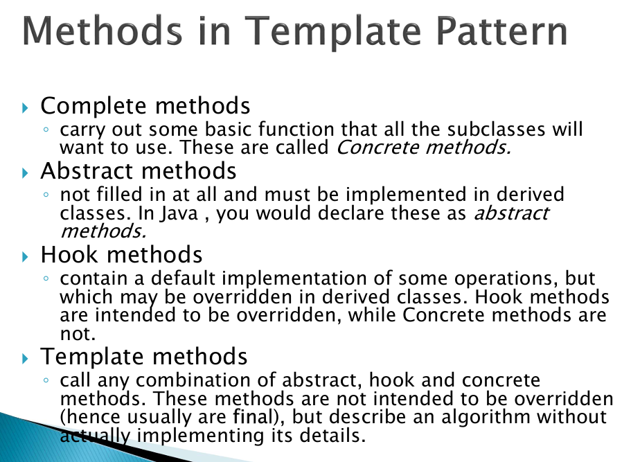
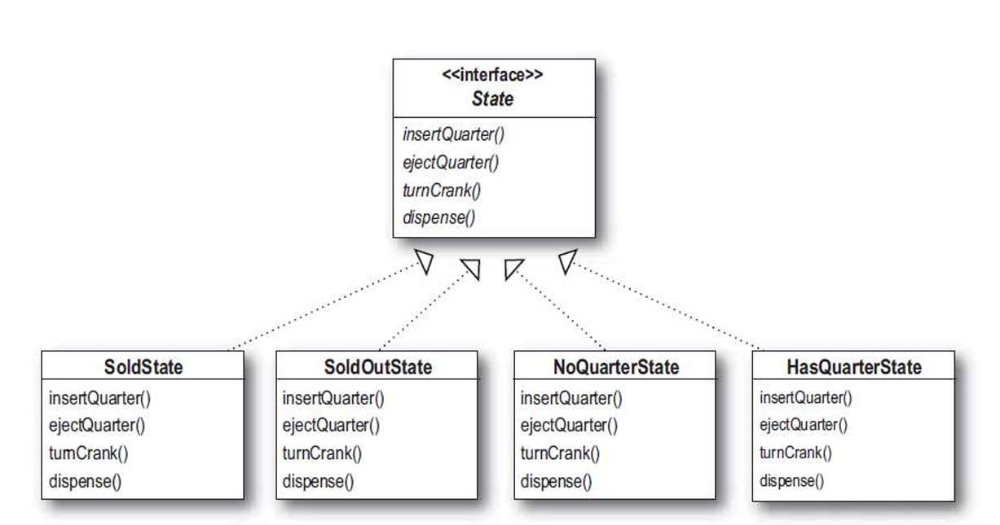

* Strategy pattern  
전략패턴은 interface를 상속받아 알고리즘을 교체  
ex) 결제방식

* 옵저버 패턴  
주체 객체가 있고 주체 객체가 옵저버 객체 전체를 가지고 있는다.
주체 객체에 업데이트가 일어나면 전체 옵저버에 update 메소드 실행

* Command 패턴  
커맨드 패턴은 요청을 객체로 만들어 실행자와 수행자를 분리한다.

* Template 패턴  
이미 순서를 가진 객체를 관리  
final로 순서를 고정시킨 template도 hook이라는 메소드 개념으로 
유연성을 확보할 수도 있다.

* State 패턴  
if문이 너무 많아질 때, 상태별로 클래스를 따로 만들어버리는 방법  
Strategy pattern과 유사하다.
